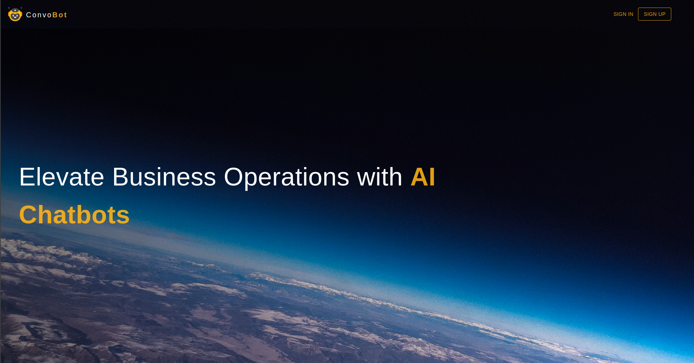

# Convobot
An application to make Open Ai driven chatbots for custome purposes without writing any code.
To Run the application follow the given steps:
1. Clone the Repo
2. Run the backend using a java version 17 or higher
3. navigate to frontend folder
4. run "npm install" and then "npm run dev" while in the frontend folder to run the front end
   
6. Add the follwing code snippet in the application.properties file in the src/main/resources folder with approproate fields

```
    spring.datasource.url=jdbc:mysql://localhost:YOOUR_LOCAL_DB_PORT/YOOUR_LOCAL_DB_SCHEMA_NAME
    spring.datasource.username=YOOUR_DB_USERNAME
    spring.datasource.password=YOOUR_DB_PASSWORD
    
    spring.jpa.database=mysql
    spring.datasource.driver-class-name=com.mysql.jdbc.Driver
    spring.jpa.database-platform=org.hibernate.dialect.MySQLDialect
    
    spring.jpa.hibernate.ddl-auto=update
    spring.jpa.properties.hibernate.format_sql=true
    spring.jpa.show-sql=true
    
    server.servlet.context-path=/convobot/api/v1
    
    openapi.apikey=YOOUR_API_KEY
```

6. Create a schema in your db wth the name used in the application.properties
7. Run the applciation
